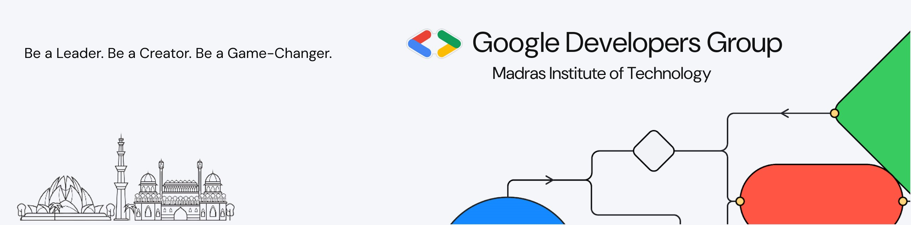

# GDG-MIT-Open-Source-Connect-Workshop :octocat:

---

Hello contributors, Welcome to [Google Developer Group on Campus MIT’s](https://gdg.community.dev/gdg-on-campus-madras-institute-of-technology-chennai-india/) "Introduction to GitHub & Open Source Workshop".

We hope you're all doing great! :octocat:

Before getting started, please review how Open Source Contribution works - [GUIDELINES.MD](GUIDELINES.md)

--- 

##<h1> TASK LIST </h1>

https://docs.google.com/document/d/1tVGelp93PygUnnFcrchZspv-h_7Zhorrj8vaRlAHl_c/edit?tab=t.0#heading=h.2do2s6f0ubxi

## Table of Contents
- [Introduction](#introduction)
- [Important Points for Contributors](#important-points-for-contributors)
- [Meaningful Contribution Guidelines](#meaningful-contribution-guidelines)
- [Instructions for Leads and Project Admins (PAs)](#instructions-for-leads-and-project-admins-pas)
- [Report Issues to Us](#report-issues-to-us)
- [List of Projects](#list-of-projects)
- [Github Markdown Resources](#github-markdown-resources)
- [GitHub README Resources](#github-readme-resources)
- [Final Notes](#final-notes)

---

## Introduction

Every contributor should remember one thing: Labels on PRs are a must-have: `gdg-mit-os`, `l1`, `l2`, or `l3`.
- `l1`: 10 points
- `l2`: 25 points
- `l3`: 45 points

---

## Important Points for Contributors

- **Meaningful Contributions**: Build your GitHub profile with meaningful badges and PRs.
- **Manual Verification**: Our team will verify most of your PRs.
- **Avoid Spam**: Do not submit spam PRs or address similar issues repeatedly.
- **GitHub Profile**: If all of your contributions are meaningful to the projects, we have the potential to increase perks and opportunities, including from existing project admins.

---

## Meaningful Contribution Guidelines

- Beginners can contribute to README files, workflows, or documentation.
- PRs for README, workflow, or documentation will be evaluated and potentially upgraded based on completeness.
- Do not create multiple document change issues. Inform the contributor who worked on the documentation for future updates.
- Follow a first-come, first-served approach for issues.
- Participate in only one role: PA, lead, or Contributor.

For more details on how to contribute to projects, check - [CONTRIBUTING.md](CONTRIBUTING.md)

---

## Instructions for Leads and Project Admins (PAs)

- **Fair Issue Assignment**: Follow a first-come, first-served approach.
- **Avoid Partiality**: Ensure fair assignment of issues, don’t let PRs get merged without raising proper issues.

---

## Report Issues to Us

- **Minimal Changes**: PRs with minimal changes that are not impactful and are being awarded `l2` or `l3` points.
- **Instant PR Acceptance**: PRs accepted instantly without proper review.

### Non-Considerable PRs

- Multiple documentation or workflow issues.
- Exploiting personal connections with PAs or leads.
- Repeated documentation or workflow contributions.
- Code snippets or template-related PRs.

---

### Spam PRs or PRs Won't be Considered:

1. If you create multiple issues on documentation or workflow, your PRs won’t be considered.
2. If you know the PA or Lead and exploit it to make more PRs, your PRs won’t be considered.
3. If you completely depend on documentation or workflow or GitHub bots, only the first 150 points will be considered. Focus on a variety of contributions.
4. Contributors, you are free to create any number of PRs in any repos, excluding a few repos listed below. Sticking to a particular repo will help you gain strong knowledge of the project and the tech stack. However, if we notice you spamming PRs or issues, severe action will be taken.

#### Note: We request everyone to follow the above guidelines. We aim to make open source accessible to everyone, including beginners. If you follow the instructions, it will help us bring more perks to you. Otherwise, it may push us to verify your PRs more thoroughly.

---

## List of Projects 

| **Project Link**                                                                                     | **Tech Stack**                                    |
|------------------------------------------------------------------------------------------------------|--------------------------------------------------|
| [Stark Hub](https://github.com/gdgmit/stark-hub)                                                    | HTML, CSS, JS                                    |
| [Sweet Scoops](https://github.com/gdgmit/sweet-scoops)                                              | HTML, CSS, JS                                    |
| [Beautiify](https://github.com/gdgmit/Beautiify)                                                    | HTML, CSS, JS                                    |
| [Frontend Master](https://github.com/gdgmit/frontend-master)                                        | HTML, CSS, JS, React, Tailwind                   |
| [ChatSphere](https://github.com/gdgmit/ChatSphere)                                                  | HTML, CSS, JS, PHP, MySQL                        |
| [SCoE Website](https://github.com/gdgmit/scoe-website)                                              | HTML, CSS, JS, PHP, MySQL                        |
| [Fit Freak](https://github.com/gdgmit/fit-freak)                                                    | React                                            |
| [React Projects](https://github.com/gdgmit/react-projects)                                          | React                                            |
| [AgriTech AI](https://github.com/gdgmit/AgriTech-AI)                                                | React, Node, Express, MongoDB, Flask, Python, Streamlit |
| [Code Racher](https://github.com/gdgmit/code-racer)                                                 | Next js, Tailwind, Typescript                    |
| [PySnippets](https://github.com/gdgmit/PySnippets)                                                  | Python                                           |
| [Predictly](https://github.com/gdgmit/predictly)                                                    | Python, Streamlit, ML, DL                        |
| [EventX](https://github.com/gdgmit/EventX)                                                          | Java, MySQL                                      |
| [AlgoHub](https://github.com/gdgmit/algohub)                                                        | Markdown, Documentation, C, C++, Python, Java   |

## GitHub Markdown Resources

- [Markdown Cheatsheet by lifeparticle](https://github.com/lifeparticle/Markdown-Cheatsheet)
- [Markdown Cheat Sheet on GeeksforGeeks](https://www.geeksforgeeks.org/markdown-cheat-sheet-github/)
- [GitHub Docs: Quickstart for Writing on GitHub](https://docs.github.com/en/get-started/writing-on-github/getting-started-with-writing-and-formatting-on-github/quickstart-for-writing-on-GitHub)

## GitHub README Resources

- [Profile README Generator](https://profile-readme-generator.com/)
- [GitHub Profile README Maker](https://gprm.itsvg.in/)
- [Readme.so: README Generator](https://readme.so/)
- [Awesome GitHub Profile README](https://github.com/abhisheknaiidu/awesome-github-profile-readme)
- [Recode Hive: Awesome GitHub Profiles](https://recodehive.github.io/awesome-github-profiles/)

## Final Notes

We request everyone to follow the above guidelines. Our goal is to make open source accessible to everyone, including beginners. Genuine contributions will help you build healthy relationships and secure great job opportunities.

If you find someone violating these rules, please inform us.

Wishing you all a happy contribution!! 👍

Thanks & Regards,  
Team OpenMITation (GDG MIT)
